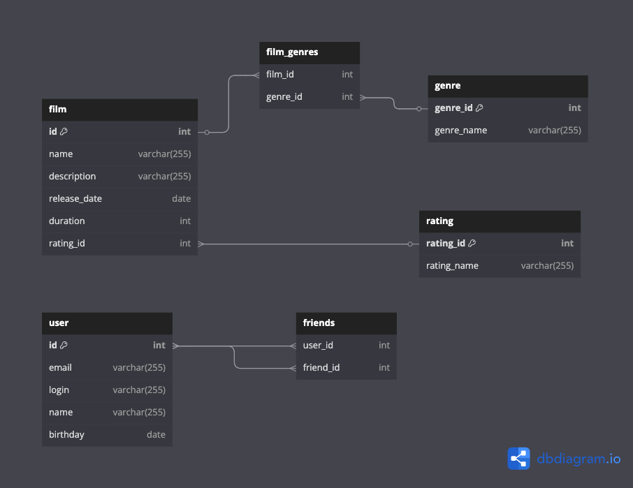

# java-filmorate
Template repository for Filmorate project.

## Схема Базы Данных

## Описание Базы Данных

## films

Содержит информацию о фильмах.
Таблица включает такие поля:
* первичный ключ **film_id** - идентификатор фильма;
* **name** - название фильма;
* **description** - описание фильма;
* **release_date** - дата релиза;
* **duration** - продолжительность фильма в минутах;
* **mpa_id** - рейтинг Ассоциации кинокомпаний.

## film_genres

Содержит информацию о id жанрах фильмов из таблицы films.
Таблица включает такие поля:
* **genre_id** - идентификатор жанра;
* **film_id** - идентификатор фильма.

## friends

Содержит информацию о дружбе пользователей.
Таблица включает такие поля:
* **user_id** - идентификатор пользователя,
* **friend_id** - идентификатор друга.

## genre

Содержит информацию о жанрах фильмов.
Таблица включает такие поля:
* первичный ключ **genre_id** - идентификатор жанра
* **genre** - название жанра.

## rating

Содержит информацию о возрастных ограничениях фильмов.
Таблица включает такие поля:
* первичный ключ **mpa_id** - код рейтинга Ассоциации кинокомпаний(G, PG, PG-13, R, NC-17),
* **mpa** - описание кода рейтинга.

## users

Содержит информацию о пользователях.
Таблица включает такие поля:
* первичный ключ **user_id** - идентификатор пользователя,
* **email** - электронная почта,
* **login** - логин,
* **name** - имя,
* **birthday** - дата рождения.

## Код DDL

CREATE TABLE if not exists mpa_rating (
mpa_id INT GENERATED BY DEFAULT AS IDENTITY PRIMARY KEY,
mpa varchar(255) NOT NULL
);

CREATE TABLE if not exists genres (
genre_id INT GENERATED BY DEFAULT AS IDENTITY PRIMARY KEY,
genre varchar(255) NOT NULL
);

CREATE TABLE if not exists users (
user_id INT GENERATED ALWAYS AS IDENTITY PRIMARY KEY,
email varchar(255) NOT NULL UNIQUE,
login varchar(255) NOT NULL UNIQUE,
name varchar(255) NOT NULL,
birthday date
);

-- Затем создаем таблицы, которые ссылаются на другие
CREATE TABLE if not exists films (
film_id INT GENERATED ALWAYS AS IDENTITY PRIMARY KEY,
name varchar(255) NOT NULL,
description varchar(255) NOT NULL,
release_date date NOT NULL,
duration int NOT NULL,
mpa_id int NOT NULL,
FOREIGN KEY (mpa_id) REFERENCES mpa_rating (mpa_id)
);

CREATE TABLE if not exists film_genres (
film_id int NOT NULL,
genre_id int NOT NULL,
PRIMARY KEY(film_id, genre_id),
FOREIGN KEY (film_id) REFERENCES films (film_id),
FOREIGN KEY (genre_id) REFERENCES genres (genre_id)
);

CREATE TABLE if not exists friends (
user_id int NOT NULL,
friend_id int NOT NULL,
PRIMARY KEY (user_id, friend_id),
FOREIGN KEY (user_id) REFERENCES users (user_id),
FOREIGN KEY (friend_id) REFERENCES users (user_id)
);

CREATE TABLE if not exists film_likes (
film_id int NOT NULL,
user_id int NOT NULL,
PRIMARY KEY (film_id, user_id),
FOREIGN KEY (film_id) REFERENCES films (film_id),
FOREIGN KEY (user_id) REFERENCES users (user_id)
);

MERGE INTO genres AS target
USING (VALUES
(1, 'Комедия'),
(2, 'Драма'),
(3, 'Мультфильм'),
(4, 'Триллер'),
(5, 'Документальный'),
(6, 'Боевик')
) AS source (genre_id, genre)
ON target.genre_id = source.genre_id
WHEN MATCHED THEN
UPDATE SET genre = source.genre
WHEN NOT MATCHED THEN
INSERT (genre_id, genre) VALUES (source.genre_id, source.genre);

MERGE INTO mpa_rating AS target
USING (VALUES (1, 'G'),
(2, 'PG'),
(3, 'PG-13'),
(4, 'R'),
(5, 'NC-17')
) AS source (mpa_id, mpa)
ON target.mpa_id = source.mpa_id
WHEN MATCHED THEN
UPDATE SET mpa = source.mpa
WHEN NOT MATCHED THEN
INSERT (mpa_id, mpa) VALUES (source.mpa_id, source.mpa);